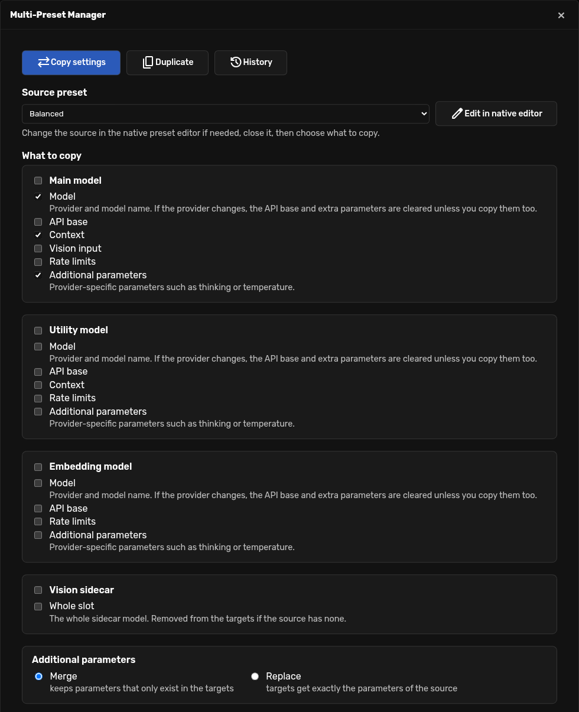
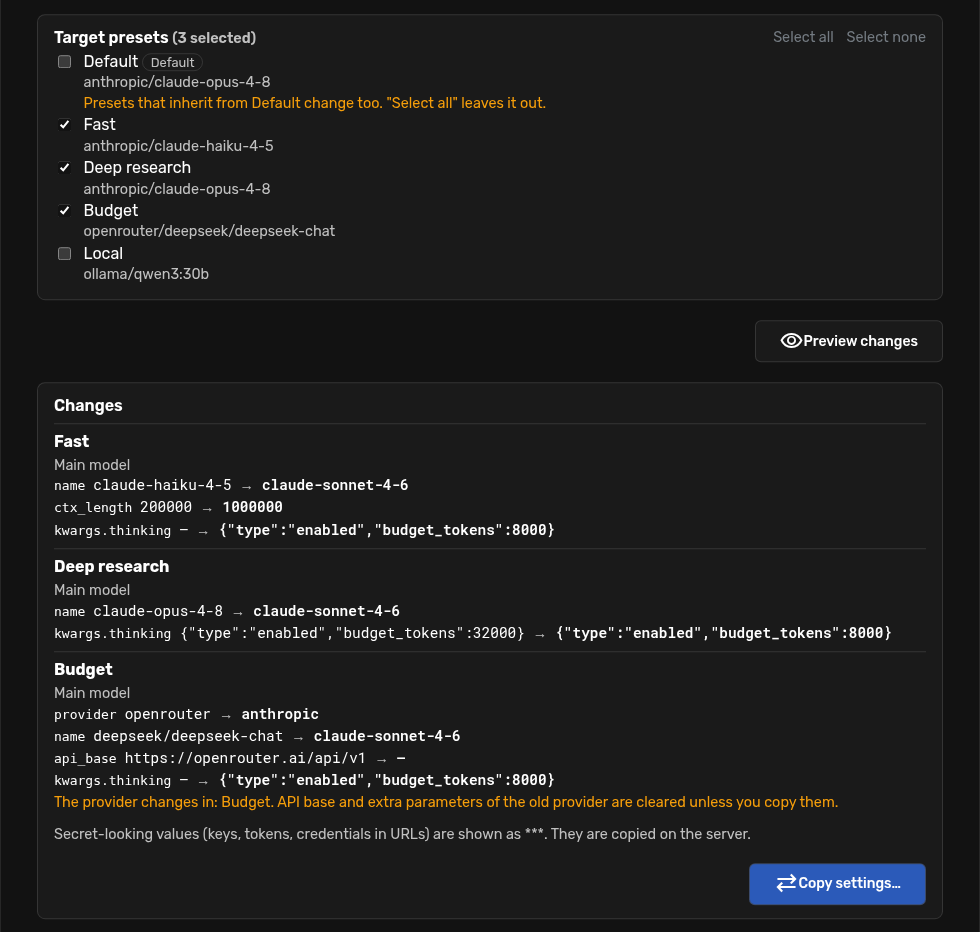
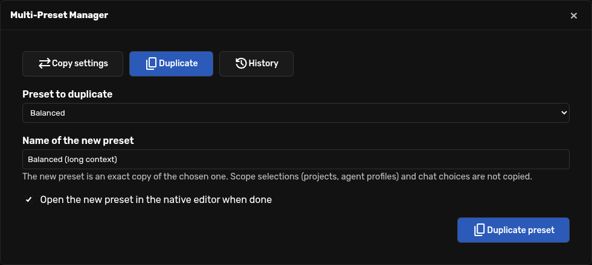
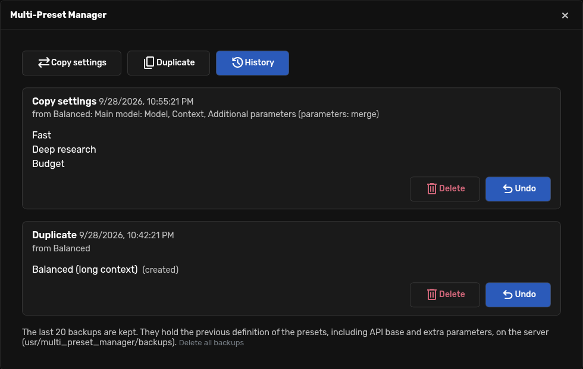

# Multi-Preset Manager

An [Agent Zero](https://github.com/agent0ai/agent-zero) plugin to manage several **model presets**
at once. It saves time when you keep many presets that are almost the same:

- **Copy settings**: change a preset (in the native preset editor) and copy the groups of settings you
  choose, such as the main model, the context size or the extra parameters, to any set of other presets.
- **Duplicate**: create a new preset from an existing one under a new name.
- **History**: every operation is backed up first, so a mistake is one click to undo.

No external services, no network calls, no extra dependencies. It only reads and writes the presets
through Agent Zero's own model configuration code, so it behaves exactly like the native editor.



## Install

In Agent Zero open **Plugins → Install**, choose **Git** and use:

```text
https://github.com/spcdatapro/multi-preset-manager
```

Then open it from the sidebar quick-actions menu (**Multi-Preset Manager**) or from
**Plugins → Multi-Preset Manager → Open**.

Tested with Agent Zero v2.13.

## Usage

### Copy settings

1. Pick the **source preset**. Use **Edit in native editor** if you need to change it first, then close
   the editor.
2. Tick what to copy. Each model (Main, Utility, Embedding) has its own groups:

   | Group | Fields |
   | --- | --- |
   | Model | provider and model name |
   | API base | `api_base` |
   | Context | context length and history/input ratio |
   | Vision input | Main model only: vision support and maximum embeds |
   | Rate limits | request, input and output limits |
   | Additional parameters | provider-specific parameters (`kwargs`), such as `thinking` or `temperature` |

   The **Vision sidecar** is copied as a whole slot (or removed from the targets if the source has none).
   For additional parameters choose **Merge** (keys of the source are added or overwritten, keys that only
   exist in the target are kept) or **Replace** (the target gets exactly the parameters of the source).
3. Tick the **target presets** and press **Preview changes**. The preview lists the effective differences
   of every affected preset, including presets that inherit the change from `Default`.
4. Press **Copy settings…** and confirm.



Things to know:

- A group is copied as *stored*: if the source does not set a field (it inherits it from `Default`), the
  field is removed from the target so it inherits the same way. The **Model** group always copies the
  effective provider and model of the source.
- If the provider changes, the API base and the additional parameters belong to the old provider and are
  cleared, unless you copy those groups as well.
- `Default` is left out of **Select all**. Changing it changes every preset that inherits from it.
- If an embedding model changes, Agent Zero re-indexes the memory the next time it is used, which can take
  a while. The preview warns you.
- Close the native preset editor before copying: saving it afterwards would overwrite the copied settings.
- Values that look like secrets (keys named `api_key`, `token`, `authorization`…, and credentials inside
  URLs) are masked as `***` in the preview. The copy itself happens on the server.

### Duplicate

Pick the preset, type the new name and press **Duplicate preset**. The copy is exact and is placed right
after the original. Names must be unique (case-insensitive) and the plugin never renames silently. Project,
agent and chat selections are not copied.



### History (backups and undo)

Before anything is written, the previous definition of every preset that changes is saved.
**History → Undo** restores it (or removes the presets that were created). If a preset was edited after the
operation, Undo tells you and lets you keep those later edits or restore anyway. The last 20 operations are
kept.



Backups contain the previous definitions of the presets, **including `api_base` and additional parameters**,
in `usr/multi_preset_manager/backups/` on the Agent Zero server (owner-only permissions). Delete them from
the History tab whenever you want.

## Uninstall

Delete the plugin from the Plugins dialog. Uninstalling also deletes its backups, so nothing sensitive is
left behind. Your presets are never touched. If you delete the folder by hand instead, remove
`usr/multi_preset_manager/` yourself.

## Development

The plugin lives in `usr/plugins/multi_preset_manager/`. Tests use `pytest` and run with the framework's
Python from the Agent Zero root, on a throwaway copy of the model configuration:

```bash
python -m pytest usr/plugins/multi_preset_manager/tests -q
```

## License

MIT, see [LICENSE](LICENSE).
